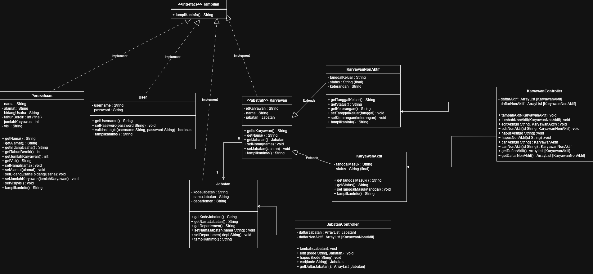

# Sistem Informasi Perusahaan
Aplikasi manajemen informasi perusahaan berbasis Java Swing yang dirancang untuk mengelola data karyawan pada sebuah perusahaan furniture.

## Anggota Kelompok 1

| Nama | NIM | Role |
|------|-----|------|
| Naila Zahra Yasmine | 254311006 | Role 1 - Class Architect & Git Master |
| Azza Maulidya Wardani | 254311004 | Role 2 - Data & Logic Engineer & JUnit Test |
| Dhea Novika |  254311009 | Role 3 - UI & Robustness Engineer & Dokumentasi |

---

## Requirement
- Java Development Kit (JDK) versi 17 atau lebih tinggi
- Tidak memerlukan library eksternal (Menggunakan javax.swing bawaan standar Java untuk antarmuka)
---

## Arsitektur Class
Hierarki pewarisan

```
Tampilan (interface)
    -- User
    -- Perusahaan
    -- Jabatan
    -- Karyawan (abstrak)
            -- KaryawanAktif
            -- KaryawanNonAktif
```
**Penerapan OOP**
| Pilar | Implementasi |
|-------|-------------|
| Encapsulation | Semua field `private`, akses via getter/setter |
| Inheritance | `KaryawanAktif` dan `KaryawanNonAktif` extends `Karyawan` |
| Polymorphism | `tampilkanInfo()` berbeda di tiap subclass |
| Abstraction | `Karyawan` abstract, `Tampilan` interface |

**Keputusan Desain**
- `Karyawan` dibuat abstract karena setiap karyawan pasti aktif atau non-aktif
- `jabatan` bertipe `Jabatan` bukan `String` untuk menerapkan relasi asosiasi
- `tahunBerdiri` bersifat `final` karena fakta historis yang tidak bisa berubah
- Validasi ada di constructor dan setter untuk memastikan objek selalu valid
- `status` di `KaryawanAktif` dan `KaryawanNonAktif` bersifat `final` karena status ditentukan oleh jenis class-nya, bukan input dari luar
---

## Class Diagram

---

## Struktur File
```
tugas_akhir_pbo/
    -- Main.java #titik masuk program
    -- LoginFrame.java #halaman login
    -- MainFrame.java #halaman utama
    -- PanelKaryawanAktif.java #tab karyawan aktif
    -- PanelKaryawanNonAktif.java #tab karyawan non-aktif
    -- PanelPerusahaan.java #tab informasi perusahaan
    -- AuthController.java #controller autentikasi
    -- KaryawanController.java #controller karyawan
    -- JabatanController.java #controller jabatan
    -- Karyawan.java #abstract class karyawan
    -- KaryawanAktif.java #subclass karyawan aktif
    -- KaryawanNonAktif.java #subclass karyawan non-aktif
    -- Jabatan.java #class jabatan
    -- Perusahaan.java #class perusahaan
    -- Tampilan.java #interface tampilan
    -- user.java #class user
    -- README.md #dokumentasi project
```
---

## Cara Instalasi & Setup

1. Clone repository ini:
```bash
git clone https://github.com/NailaZahraYsmn/tugas_akhir_pbo
```
2. Masuk ke folder project:
```bash
cd tugas_akhir_pbo
```
3. Compile semua file Java:
```bash
javac *.java
```
---

## Cara Menjalankan
```bash
java Main
```
---

## Cara Penggunaan
1. **Login** — masukkan username dan password
   - Username default: `admin`
   - Password default: `123456`

2. **Tab Karyawan Aktif**
   - Isi form di sebelah kanan
   - Klik *Tambah* untuk menambah karyawan baru
   - Klik baris di tabel lalu klik *Edit* untuk mengubah data
   - Klik baris di tabel lalu klik *Hapus* untuk menghapus data
   - Klik *Clear* untuk mengosongkan form

3. **Tab Karyawan Non-Aktif**
   - Isi form di sebelah kanan
   - Klik *Tambah* untuk menambah karyawan baru
   - Klik baris di tabel lalu klik *Hapus* untuk menghapus data
   - Klik *Clear* untuk mengosongkan form
   - Isi keterangan alasan non-aktif (contoh: Cuti Melahirkan, Sakit)

4. **Tab Perusahaan**
   - Menampilkan informasi detail perusahaan

5. **Logout** — klik tombol Logout di pojok kanan atas
---

## Contributing
```
Pull requests are welcome. For major changes, please open an issue first
to discuss what you would like to change.
Please make sure to update tests as appropriate.
```
---
## Update Versi 2.0

Class `KaryawanMagang` merupakan subclass dari `KaryawanAktif` yang digunakan untuk merepresentasikan karyawan dengan status magang dalam sistem manajemen perusahaan. Class ini menambahkan atribut khusus berupa `durasiMagang` untuk menyimpan lama masa magang karyawan.

---

**Fitur Utama**
- Mewarisi data dari `KaryawanAktif`
- Menambahkan atribut `durasiMagang` (dalam bulan)
- Validasi input durasi magang (harus lebih dari 0)
- Override method `tampilkanInfo()` untuk menampilkan data lengkap karyawan magang
- Mendukung exception handling menggunakan `InputTidakValidException`

---

**Struktur Class**

**Atribut**
- `private int durasiMagang`  
  Menyimpan lama masa magang karyawan (dalam bulan)

---

**Constructor**
```java
KaryawanMagang(String idKaryawan, String nama, Jabatan jabatan,
               String tanggalMasuk, int durasiMagang)
